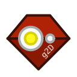
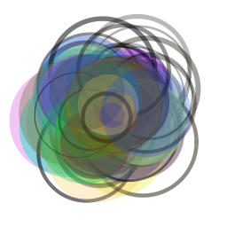
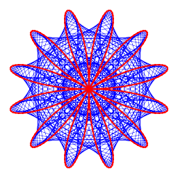
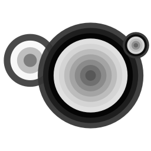
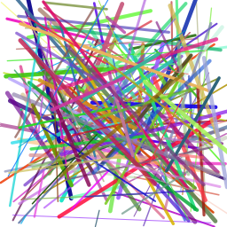
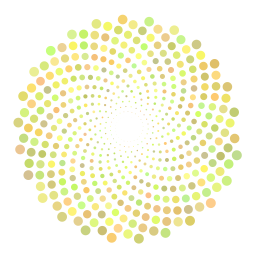

# `g2D` - Geometry art built coding

Use the code basics like loops, control flow and specialized functions to generate your geometry artworks.

## Examples of g2D Geometry Art

- source code in [_examples](./_examples) folder

 &nbsp;  &nbsp; 

 &nbsp;  &nbsp; 

---

## Installation


### [Go](https://golang.org/doc/install) get

```bash
$ go get -u github.com/lucasepe/g2d
```

## Ready-To-Use Releases 

[Here you can find `g2d` already compiled](https://github.com/lucasepe/g2d/releases/latest) for:

- MacOS 
- Linux 
- Windows

---

## How to use

To execute a local `g2d` script:

```bash
$ g2d /path/to/my-script.g2d
```

To execute a `g2d` script stored somewhere on the web:

```bash
$ g2d http://my-cool-site.com/remote/path/to/my-script.g2d
```

Use the `--directory` (or the shorter `-d`) flag to specify a destination folder for the generated PNG images.

---


## The `g2D` Programming Language Syntax

Example-programs can be found beneath [examples/](examples/) which demonstrate these things, as well as parts of the standard-library.

### Types

g2D has the following data types: `bool`, `int`, `float`, `str`, `array`, and `fn`.

Type      | Syntax                                    | Notes                                           |
--------- | ----------------------------------------- | ----------------------------------------------- |
bool      | `true false`                              |                                                 |
int       | `0 42 1234 -5`                            | is a signed 64-bit integer                      |
float     | `0.5 4.2 1.234 -5.5`                      | is a 64-bit double-precision floating point     |
str       | `"" "foo" "\"quotes\" and a\nline break"` | are immutable arrays of bytes                   |
array     | `[] [1, 2] [1, 2, 3]`                     | grow-able arrays (*use the `append()` builtin*) |
fn        | `fn(a, b) { ... }`                        | defines a custom function                       |


### Bindings

Variables are bounded using the `:=` operator.

```go
a := 3
b := 1.2
```

Variables may be integers, floats, strings, or arrays/hashes.

To update a variable you can simply specify the equals `=` operator:

```go
a := 3    // Binding
a = a + 5 // Updating
```

### Arithmetic operations

`g2D` supports all the basic arithmetic operation of `int` and `float` types.

```go
a := 5
b := 3

c := a + b
d := c / 2
e := d * d
```

### Builtin containers

`g2d` has one builtin containers: `array`.

#### Arrays

An array is a list which organizes items by linear sequence.  Arrays can hold multiple types.

```go
a := [1, 2.3, "hello!"]
b := [false, true, "Hello World", 3, 3.13]
```

Adding to an array is done via the `push` builtin function:

```go
a = append(a, "another")
```

You can iterate over the contents of an array like so:

```go
i := 0
while( i < len(a) ) {
    print( "Array index ", i, " contains ", a[i], "\n")
    i = i + 1
}
```

With the definition we included that produces this output:

```text
Array index 0 contains 1
Array index 1 contains 2.3
Array index 2 contains hello!
Array index 3 contains another
```

### Functions

`g2D` uses `fn` to define a function which will be assigned to a variable for naming/invocation purposes:

```go
sum := fn(a, b) { return a + b }

print(sum(5,3), "\n")       // Outputs: 8
print(sum(2.5,7.5), "\n")   // Outputs: 10
```

Functions can be passed as values to others functions:

```go
addTwo := fn(a, b, f) { 
    return 2 + f(a, b) 
}

tot := addTwo(68, 1, sum)
print(tot, "\n")            // Outputs: 71
```

Functions inside functions

```go
multiplier := fn(q) {
    return fn(x) {
        return x*q
    }
}

multThree := multiplier(3)

print(multThree(2), "\n")  // Outputs: 6
print(multThree(3), "\n")  // Outputs: 9
print(multThree(4), "\n")  // Outputs: 12
```

### If-else statements

`g2D` supports `if-else` statements.

```go
max := fn(a, b) {
    if (a > b) {
        return a;
    } else {
        return b;
    }
}

print( max(1, 2) )  // Outputs: 2
```

### Switch Statements

`g2D` supports the `switch` and `case` expressions:

```go
switch n := randi(10) {
    case n % 2 == 0 {
        print(n, " is even", "\n")
    }
    default {
        print(n, " is odd", "\n")
    }
}
```

### While Loops

`g2D` supports only one looping construct, the `while` loop:

```go
i := 30
while (i > 0) {
    print(i, " ")
    i = i - 10
}
// 30 20 10
```

---

## Builtin functions

### Core

Function               | Description
---------------------- | -------------------------------------------------------------------------- | 
`exit([status])`       | exits the program immediately with the optional status or 0                |
`input([prompt]`       | reads a line from standard input optionally printing the specified prompt  |
`print(...)`           | output a string to stdout                                                  |
`printf(pattern, ...)` | output a string to stdout (formatted according the specified pattern)      |
`sprintf(pattern, ...)`| like `printf(...)` but returns a _string_                                  |
`bool(val)`            | converts value to a bool                                                   |
`float(val)`           | converts decimal value str to _float_ - if _val_ is invalid returns _null_ |
`int(val)`             | converts decimal value str to _int_ - if _val_ is invalid returns _null_   |
`str(val)`             | returns the string representation of _val_                                 |
`len(iterable)`        | returns the length of the iterable (_string_ or _array_)           |
`append(array, val)`   | returns a new array with value pushed onto the end of array                |


### Calculation

Function                | Description
----------------------- | -------------------------------------------------------------------------- | 
`abs(x)`                | returns the absolute value of _x_                                          |
`atan(x)`               | returns the arc tangent, in radians, of _x_                                |
`atan2(x, y)`           | returns the arc tangent of _y/x_                                           |
`cos(x)`                | returns the cosine of the radian argument _x_                              |
`degrees(angle)`        | converts radians into degrees                                              | 
`hypot(p, q)`           | returns `sqrt(p*p + q*q)`                                                  |
`lerp(start, stop, amt)`| calculates a number between two numbers at a specific increment            |
`map(v, b1, e1, b2, e2)`| re-maps a number from one range to another                                 |
`max(v1....vn)`         | returns the largest value in a sequence of numbers                         |
`min(v1....vn)`         | returns the smallest value in a sequence of numbers                        |
`pow(x, y)`             | returns `x**y`, the base _x_ exponential of _y_                            |
`sin(x)`                | returns the sine of the radian argument _x_                                |
`sqrt(x)`               | returns the square root of _x_                                             |
`radians(angle)`        | converts a degree measurement to its corresponding value in radians        |
`randf([min], [max])`   | returns a random float between min and max - by default min=0.0 and max=1.0|
`randi([min], [max])`   | returns a random int between min and max                                   |

### Basic graphic functions

Function                              | Description
------------------------------------- | ------------------------------------------------------------------------------------- | 
`size(w,[h])`                         | sets the size of the drawing; when both _w_ and _h_ are specified creates a rectangular image otherwise creates a squared one |
`viewport(xMin, xMax, yMin, yMax, xOffset, yOffset)` | sets up user-defined coordinate system; performs a screen reset (drawings are cleared)|
`clear()`                             | fills the entire image with the current color; clear all drawings                     |
`fillColor(hexcolor)`               | sets the fill color to the specified _hexcolor_; example _fillColor("#ff0000")_         |
`fillColor(r, g, b, [a])`           | sets the fill color to _r,g,b,a_ values - should be between 0 and 255, inclusive        |
`strokeColor(hexcolor)`               | sets the stroke color to the specified _hexcolor_; example _strokeColor("#ff0000")_   |
`strokeColor(r, g, b, [a])`           | sets the stroke color to _r,g,b,a_ values - should be between 0 and 255, inclusive    |
`strokeWeight(weight)`                | sets the stroke thickness to the specified _width_                                    |
`dashes([s1, s2, ...sn])`             | sets the current dash pattern to use (call with zero arguments to disable dashes)     |
`stroke()`                            | strokes the current path with the current stroek color and line width the path is cleared after this operation |
`fill()`                              | fills the current path with the current fill color; open subpaths are implicity closed.<br/> The path is cleared after this operation |
`fillAndStroke()`                     | fills the current path with the current fill color and strokes it with the current stroke color; the path is cleared after this operation |
`push()`                              | saves the current state of the graphic context by pushing it onto a stack |
`pop()`                               | restores the last saved graphic context state from the stack |
`snapshot([filename])`                | creates a PNG image with the current drawings. <br/>If _filename_ is omitted, it will be autogenerated with a progressive counter, that will be incremented on each <br/> `snapshot()` invocation; this is useful if you wants to generate an animation later (using all the generated PNG images). |
`xpos()`                              | returns the current X position (if there is a current point) |
`ypos()`                              | returns the current Y position (if there is a current point) |

### Graphic primitives

Function                              | Description
------------------------------------- | ------------------------------------------------------------------------------------- | 
`arc(x, y, r, sa, ea)`                | draws a circular arc centered at _(x, y)_ with a radius of _r_.<br/> The path starts at _sa_ angle_, ends at _ea_ angle, and travels in the direction given by anticlockwise |
`circle(x, y, r)`                     | draws a circle centered at _[x, y]_ coordinates and with the radius _r_               |
`ellipse(x, y, rx ,ry)`               | draws an ellipse centered at [x, y] coordinates and with the radii _rx_ and _ry_      |
`line(x1, y1, x2, y2)`                | draws a line from point _(x1, y1)_ to point _(x2, y2)_                                |
`point(x, y)`                         | draws a point at specified coordinates (the size is equal to the stroke weight)       |
`quad(x1, y1, x2,y2, x3,y3, x4,y4)`   | draws a a four sided polygon using the provided vertices                              |
`rect(x, y, w, h, [tl, tr, br, bl])`  | draws a (w x h) rectangle with upper left corner located at _(x, y)_.<br/> If only one radius is specified, all the corners have the same bending, if _tl_, _tr_, _br_, _bl_ are specified, each corner can have a different curvature        |
`triangle(x1,y1, x2,y2, x3,y3)`       | draws a triangle using the provided vertices                                          |
`star(cx, cy, n, or, ir)`             | draws a star _cx_, _cy_ is the center, _n_ the number of spikes, _or_ and _ir_ the outer and inner radius |

### Paths

Function                              | Description
------------------------------------- | -------------------------------------------------------------------------------------- | 
`beginPath()`                         | starts a new path                                                                      |
`closePath()`                         | adds a line segment from the current point to the beginning of the current subpath     |
`moveTo(x, y)`                        | sets the begin of a new subpath starting at the specified _x_, _y_ point               |
`lineTo(x, y)`                        | adds a line segment to the current path starting at the current point                  |
`arcTo(x1, y1, x2, y2, r)`            | adds a circular arc to the current sub-path, using the given control points and radius |
`quadraticCurveTo(x1, y1, x2, y2)`    | adds a quadratic Bézier curve to the current sub-path; _x1_, _y1_ is the control point and _x2_, _y2_ is the end point |

### Transform

Function                              | Description
------------------------------------- | -------------------------------------------------------------------------------------- | 
`rotate(angle, [x, y] )`              | updates the current matrix with a anticlockwise rotation; when _x, y_ are specified, rotation occurs about this point, otherwise rotation occurs about the origin (_angle_ is in radians) |
`scale(sx, sy, [x, y])`               | updates the current matrix with _sx_, _sy_ scaling factor; when _x_,_y_ are specified, scaling occurs about this point, otherwise scaling occurs about origin. |
`translate(x, y)`                     | updates the current matrix with a translation to _x_ and _y_                           |
`identity()`                          | resets the current transformation matrix to the identity matrix                        |
`transform(x, y)`                     | multiplies the point _x_, _y_ by the current matrix, returning a transformed position  | 

### Text

Function                              | Description
------------------------------------- | -------------------------------------------------------------------------------------- | 
`text(str, x, y, [ax, ay])`           | draws the specified text _str_ at the specified anchor point _x_, _y_; the anchor point is _x - w * ax_, _y - h * ay_, where _w_, _h_ is the size of the text (by default _ax=0.5_, _ay=0.5_ to center the text at the specified point)        |
`textWidth(str)`                      | returns the rendered width of the specified text _str_ given the current font face     |
`fontSize(size)`                      | sets the font height                                                                   |

### Images

Function                              | Description
------------------------------------- | -------------------------------------------------------------------------------------- | 
`imageGet(path/to/png)`               | loads a PNG image from the local filesystem                                            |
`imageAt(im, x, y, [ax, ay])`         | draws the specified image _im_ at the specified anchor point _x_, _y_; (_ax_ and _ay_ are the x and y offsets) use ax=0.5, ay=0.5 to center the image at the specified point  |
